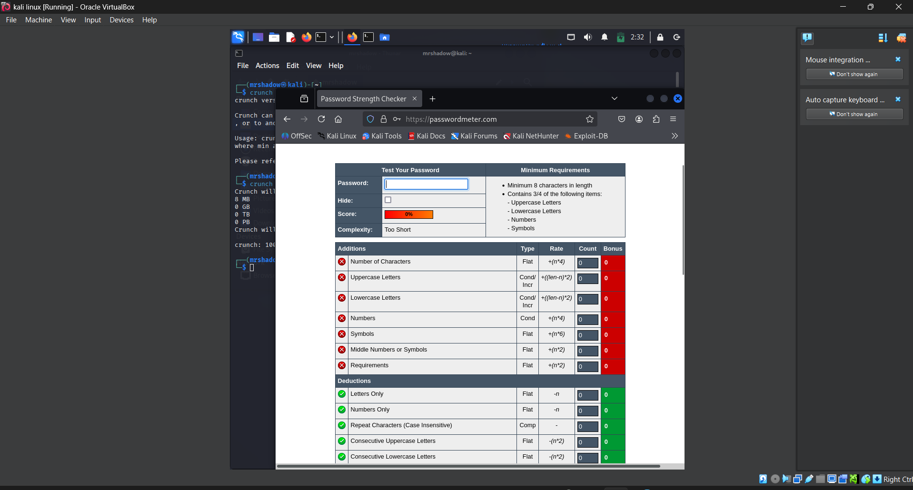
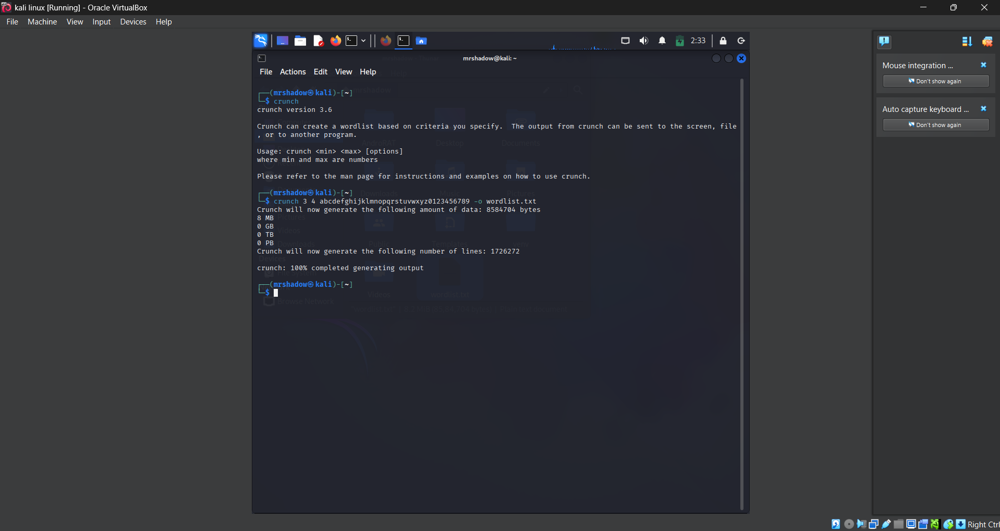
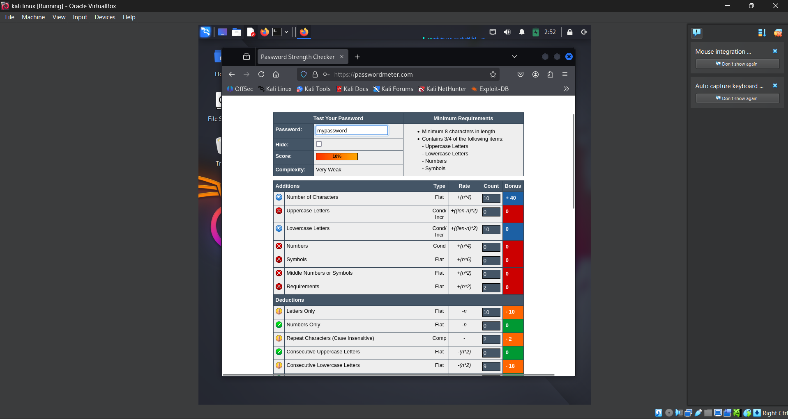
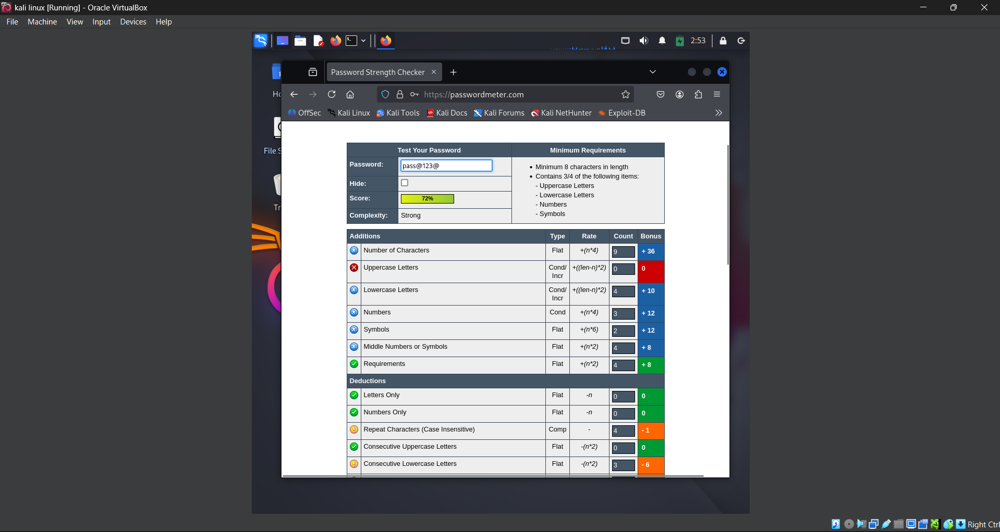
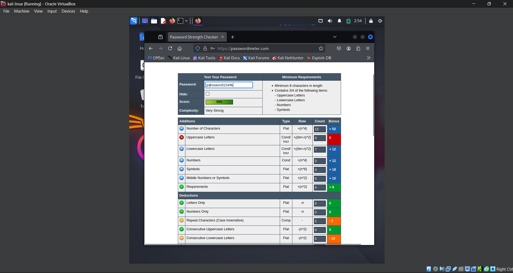

# Password-Strength-Evaluation
Password Strength Evaluation is a security tool that analyzes passwords for complexity and resilience against attacks. It checks length, character variety, and patterns, then rates strength as weak, medium, or strong—helping users create secure, hard-to-crack passwords for better online protection.
# 🔐 Password Strength Evaluation

## 📌 Task Overview
This project is part of a cybersecurity internship assignment.
Objective: Understand what makes a password strong and test it using free online password strength checkers.

## 🛠 Tools Used
- **Kali Linux**
- **PasswordMeter.com** (or similar)
- Browser for online testing

## 🔹 Steps Performed
1. Created multiple passwords with varying complexity:
   - Only lowercase
   - Lowercase + numbers
   - Mixed case + numbers + symbols
   - Long passphrase
2. Tested each password on an online password strength checker.
3. Recorded the scores and feedback.
4. Researched best practices for strong passwords.
5. Summarized tips and observations.

## 📊 Password Test Summary
| Password Type        | Example         | Strength Score | Feedback                          |
|----------------------|----------------|---------------|------------------------------------|
| Weak (lowercase)     | `mypassword`   | 20%           | Too short, lacks complexity       |
| Medium               | `MyPass123`    | 60%           | Add symbols, increase length      |
| Strong               | `P@ssW0rd!2025`| 90%           | Very strong password              |
| Passphrase           | `Horse-Battery-Staple-2025!` | 95% | Long, unique, hard to guess |

## 💡 Tips Learned
- Use **12+ characters**.
- Mix **uppercase, lowercase, numbers, symbols**.
- Avoid dictionary words.
- Use passphrases for easier recall.
- Enable **multi-factor authentication** for extra security.

## 📷 Screenshots

---
**Outcome:** Learned how password complexity impacts security and how to create hard-to-crack passwords.
